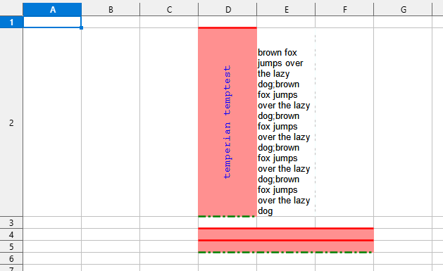
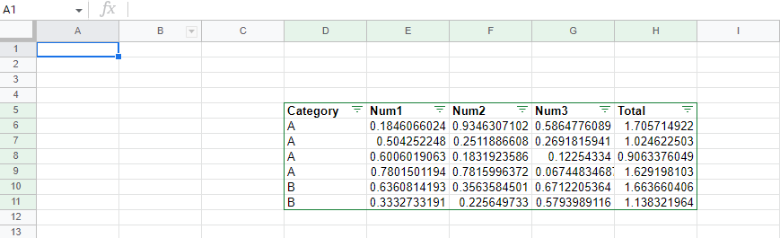

# Excelin - create and read Excel pure Nim

[](https://nimble.directory/ci/badges/excelin/nimdevel/output.html) [](https://nimble.directory/ci/badges/excelin/nimdevel/output.html) [](https://nimble.directory/ci/badges/excelin/nimdevel/doc_build_output.html)

A library to work with Excel file and/or data.

## Docs

All available APIs can be find in [docs page](https://mashingan.github.io/excelin/src/htmldocs/excelin.html).

# Examples

* [Common operations](#common-operations)
* [Working with sheets](#working-with-sheets)
* [Cell formula](#cell-formula)
* [Cell styling](#cell-styling)
* [Row display](#row-display)
* [Sheet auto filter](#sheet-auto-filter)
* [Cell merge](#cell-merge)

## Common operations
All operations available working with Excel worksheet are illustrated in below:

```nim
from std/times import now, DateTime, Time, toTime, parse, Month,
    month, year, monthday, toUnix, `$`
from std/strformat import fmt
from std/sugar import `->`, `=>`, dump
from std/strscans import scanf
from std/sequtils import toSeq
import excelin

# `newExcel` returns Excel and Sheet object to immediately work
# when creating an Excel data.
let (excel, sheet) = newExcel()

# we of course can also read from Excel file directly using `readExcel`
# we comment this out because the path is imaginary
#let excelTemplate = readExcel("path/to/template.xlsx")
# note readExcel only returns the Excel itself because there's no
# known default sheet available. Use `excelin.getSheet(Excel,string): Sheet`
# to get the sheet based on its name.

doAssert sheet.name == "Sheet1"
# by default the name sheet is Sheet1

# let's change it to other name
sheet.name = "excelin-example"
doAssert sheet.name == "excelin-example"

# let's add/fetch some row to our sheet
let row1 = sheet.row 1

# excelin.row is immediately creating when the rows if it's not available
# and if it's available, it's returning the existing.
# With excelin.rowNum, we can check its row number.
doAssert row1.rowNum == 1

# let's add another row, this time it's row 5
let row5 = sheet.row 5
doAssert row5.rowNum == 5

# in this case, we immediately get the row 5 even though the existing
# rows in the sheet are only one.

type
    ForExample = object
        a: string
        b: int

proc `$`(f: ForExample): string = fmt"[{f.a}:{f.b}]"

# let's put some values in row cells
let nao = now()
row1["A"] = "this is string"
row1["C"] = 256
row1["E"] = 42.42

row1["B"] = nao # Excelin support DateTime or Time and
                # by default it will be formatted as yyyy-MM-dd'T'HH:mm:dd.fff'.'zz
                # e.g.: 2200-12-01T22:10:23.456+01

row1["D"] = "2200/12/01" # we put the date as string for later example when fetching
                         # using supplied converter function from cell value

row1["F"] = $ForExample(a: "A", b: 200)
row1["H"] = -111
let srclink = Hyperlink(
  target: "https://github.com/mashingan/excelin",
  text: "excelin github page",
  tooltip: "lakad matataag, excelin excelin",
)
row1["J"] = srclink

# notice above example we arbitrarily chose the column and by current implementation
# Excel data won't add unnecessary empty cells. In other words, sparse row cells.
# When we're sure working with large cells and often have to update its cell value,
# we can supply the optional argument `cfFilled` to make our cells in the row filled
# preemptively.

let row2 = sheet.row(2, cfFilled) # default is cfSparse
clear row2

# While example above the new row is already empty by default,
# we can clear all cells in the row with `clear` proc.
 
# now let's fetch the data we inputted
doAssert row1["A", string] == "this is string"
doAssert row1.getCell[:uint]("C") == 256
doAssert row1["H", int] == -111
doAssert row1["B", DateTime].toTime.toUnix == nao.toTime.toUnix
doAssert row1["B", Time].toUnix == nao.toTime.toUnix
doAssert row1["E", float] == 42.42
let destlink = row1["J", Hyperlink]
doAssert destlink.target == srclink.target
doAssert destlink.text == srclink.text
doAssert destlink.tooltip == srclink.tooltip

# in above example, we fetched various values from its designated cell position
# using the two kind of function, `getCell` and `[]`. `[]` often used for
# elementary/primitive types those supported by Excelin by default. `getCell`
# has 3rd parameter, a closure with signature `string -> R`, which default to `nil`,
# that will give users the flexibility to read the string value representation
# to the what intended to convert. We'll see it below
#
# note also that we need to compare to its second for DateTime|Time instead of directly using
# times.`==` because the comparison precision up to nanosecond, something we
# can't provide in this example

let dt = row1.getCell[:DateTime]("D",
  (s: string) -> DateTime => (
    dump s; result = parse(s, "yyyy/MM/dd"); dump result))
doAssert dt.year == 2200
doAssert dt.month == mDec
doAssert dt.monthday == 1

let fex = row1.getCell[:ForExample]("F", func(s: string): ForExample =
    discard scanf(s, "[$w:$i]", result.a, result.b)
)
doAssert fex.a == "A"
doAssert fex.b == 200

# above examples we provide two example of using closure for converting
# string representation of cell value to our intended object. With this,
# users can roll their own conversion way to interpret the cell data.

# Following the pattern like sequtils.map with sequtils.mapIt and others,
# we also provide the shorthand with excelin.getCellIt

let dtIt = row1.getCellIt[:DateTime]("D", parse(it, "yyyy/MM/dd"))
doAssert dtIt.year == 2200
doAssert dtIt.month == mDec
doAssert dtIt.monthday == 1

let fexIt = row1.getCellIt[:ForExample]("F", (
    discard scanf(it, "[$w:$i]", result.a, result.b)))
doAssert fexIt.a == "A"
doAssert fexIt.b == 200

# We also provide helpers `toNum` and `toCol` to convert string-int column
# representation. Usually when we're working with array/seq of data,
# we want to access the column string but we only have the int, so this
# helpers will come handy.

let row11 = sheet.row 11
for i in 0 ..< 10: # both toCol and toNum is starting from zero.
    row11[i.toCol] = i.toCol
    
# and let's see whether it's same or not
for i, c in toSeq['A'..'J']:
    doAssert row11[$c, string].toNum == i


# finally, we have 2 options to access the binary Excel data, using `$` and
# `writeFile`. Both of procs are the usual which `$` is stringify (that's
# to return the string of Excel) and `writeFile` is accepting string path
# to where the Excel data will be written.

let toSendToWire = $excel
excel.writeFile("excelin-example-readme.xlsx")

# note that the current excelin.`$` is using the `writeFile` first to temporarily
# write to file in $TEMP dir because the current zip lib dependency doesn't
# provide the `$` to get the raw data from built zip directly.
```

[Back to examples list](#examples)


## Working-with-sheets

Another example here we work directly with `Sheet` instead of the `Rows` and/or cells.

```nim
import excelin

# prepare our excel
let (excel, _) = newExcel()
doAssert excel.sheetNames == @["Sheet1"]

# above we see that our excel has seq string with a member
# "Sheet1". The "Sheet1" is the default sheet when creating
# a new Excel file.
# Let's add a sheet to our Excel.

let newsheet = excel.addSheet "new-sheet"
doAssert newsheet.name == "new-sheet"
doAssert excel.sheetNames == @["Sheet1", "new-sheet"]

# above, we add a new sheet with supplied of the new-sheet name.
# By checking with `sheetNames` proc, we see two sheets' name.

# Let's see what happen when we add a sheet without supplying the name
let sheet3 = excel.addSheet
doAssert sheet3.name == "Sheet3"
doAssert excel.sheetNames == @["Sheet1", "new-sheet", "Sheet3"]

# While the default name quite unexpected, we can guess the "num" part
# for default sheet naming is related to how many we added/invoked
# the `addSheet` proc. We'll see below example why it's done like this.

# Let's add again
let anewsheet = excel.addSheet "new-sheet"
doAssert anewsheet.name == "new-sheet"
doAssert excel.sheetNames == @["Sheet1", "new-sheet", "Sheet3", "new-sheet"]

# Here, we added a new sheet using existing sheet name.
# This can be done because internally Excel workbook holds the reference of
# sheets is by using its id instead of the name. Hence adding a same name
# for new sheet is possible.
# For the consquence, let's see what happens when we delete a sheet below

# work fine case
excel.deleteSheet "Sheet1"
doAssert excel.sheetNames == @["new-sheet", "Sheet3", "new-sheet"]

# deleting sheet with name "new-sheet"

excel.deleteSheet "new-sheet"
doAssert excel.sheetNames == @["Sheet3", "new-sheet"]

# will delete the older one since it's the first the sheet found with "new-sheet" name
# when there's no name available, Excel file will do nothing.

excel.deleteSheet "aww-sheet"
doAssert excel.sheetNames == @["Sheet3", "new-sheet"]

# still same as before.
# Below example we illustrate how to get by sheet name.

anewsheet.row(1)["A"] = "temptest"
doAssert anewsheet.row(1)["A", string] == "temptest"
discard excel.addSheet "new-sheet" # add a new to make it duplicate
let foundOlderSheet = excel.getSheet "new-sheet"
doAssert foundOlderSheet.row(1)["A", string] == "temptest"

# Here we get sheet by name, and like deleting the sheet, fetching/getting
# the sheet also returning the older sheet of the same name.

doAssert excel.sheetNames == @["Sheet3", "new-sheet", "new-sheet"]
excel.writeFile ("many-sheets.xlsx")

# Write it to file and open it with our favorite Excel viewer to see 3 sheets:
# Sheet3, new-sheet and new-sheet.
# Using libreoffice to view the Excel file, the duplicate name will be appended with
# format {sheetName}-{numDuplicated}.
# We can replicate that behaviour too but currently we support duplicate sheet name.
```

[Back to examples list](#examples)

## Cell Formula

We support rudimentary of filling and fetching cell with format of Formula.

```nim
from std/math import cbrt
from excelin import
    newExcel,   # the usual for creating empty excel
    row,        # for fetching row from sheet
    toCol,      # to get string column from integer
    Formula,    # the cell type object this example for.
    `[]=`,      # fill cell
    `[]`,       # fetch cell
    writeFile,  # finally, to write to file

let (excel, sheet) = newExcel()
let row1 = sheet.row 1

# Let's setup some simple data in a row 1 with col A..J simple seq of int

var sum = 0 # this will be our calculated result
for i in 0 .. 9:
    row1[i.toCol] = i
    sum += i

# Here, we simply fill A1 = 0, B1 = 1, ... J1 = 9
# while the equation is to sum values from cell A to J in K1.
# Additionally, we'll add another example which depend
# on another formula cell with equation CUBE(K1) in L1

row1[10.toCol] = Formula(equation: "SUM(A1:J1)", valueStr: $sum)
let cubesum = cbrt(float64 sum)
row1[11.toCol] = Formula(equation: "CUBE(K1)", valueStr: $cubesum)

# Formula has two public fields, equation which is the formula string itself
# and valueStr, the string of calcluated value.
# Let's fetch and check it

let fmr = row1["k", Formula]
doAssert fmr.equation == "SUM(A1:J1)"
doAssert fmr.valueStr == "45"
let f1l = row1["l", Formula]
doAssert f1l.equation == "CUBE(K1)"
doAssert f1l.valueStr == $cubesum

# As this is rudimentary support for formula format, the equation itself
# is simply string that we'll fill to cell, and the value is something
# that we calculate manually on our end.

# What if we fill another formula with its equation only? The value is simply
# nothing since we didn't fill its value.

let row1["m"] = Formula(equation: "L1")
let f1m = row1["m", Formula]
doAssert f1m.equation == "L1"
doAssert f1m.valueStr == ""

# lastly, as usual, let's write to file and check it other excel viewer apps.
# note for cell M1 as we supplied empty value in above.
excel.writeFile "excelin-sum-example.xlsx"
```

[Back to examples list](#examples)

## Cell styling

In this example we'll see various styling provided for cells in row.

```nim
import std/colors # to work with coloring
from std/sequtils import repeat
from std/strutils import join
import excelin

let (excel, sheet) = newExcel()
let row2 = sheet.row 2

## Let's fill some data.
row2["D"] = "temperian temptest"

## Now we want to set some style for this particular cell D2.
row2.style("D",
    font = fontStyle(
        name = "DejaVu Sans Mono",
        size = 11,
        color: $colBlue, # blue font
    ),
    border = borderStyle(
        top = borderPropStyle(style = bsMedium, color = $colRed),
        bottom = borderPropStyle(style = bsMediumDashDot, color = $colGreen),
    ),
    fill = fillStyle(
        pattern = patternFillStyle(patternType = ptLightGrid, fgColor = $colRed)
    ),
    
    # Lastly alignment as openarray of pair (string, string),
    # using openarray for easier to iterate and can be selectively
    # chosen which style to be applied, other attributes that not recognized
    # by excel will do nothing.
    alignment = {"horizontal": "center", "vertical": "center",
        "wrapText": $true, "textRotation": $45})
        
# Libreoffice apparently doesn't support grid filling hence the bgColor is
# ignored and only read the fgColor.
# Above we setup the style after putting the value, the reverse is valid too.
# i.e. set the style and put the value.
# For setting up font, border and fill, we're using object initializer proc
# with pattern of "{objectName}Style".

row2.style("E",
    border = borderStyle(`end` = borderProp(style = bsDashDot, color = $colAzure)),
    alignment = {"wrapText": $true},
)
let longstr = "brown fox jumps over the lazy dog".repeat(5).join(";")
row2["E"] = longstr

# We can also modify set style and change the existing

row2.style "D", alignment = {"textRotation": $90}

# here, we changed the alignment style from diagonal direction (45∘)  to upstand (90∘).
# We can also share a cell style to other cells and since it's shared, any changes to
# other cells for its styling will affect all others cell it's related.

sheet.shareStyle("D2", "D4", "E4", "F4")
row2.shareStyle("D", "D4", "E4", "F4")

# Above, we shares D2 cell style to cells D4, E4, and F4 using two differents
# proc which work same. This way we can work whether we only have the sheet
# or we already have the row.

# Another way is to copyStyle, as its named so, we copy style from source cell
# to target cell(s). This way any changes to any cells it's copied from and to
# will not affect each others.

sheet.copyStyle("D2", "D5", "E5", "F5")
row2.copyStyle("D", "D5", "E5", "F5")


# Now we want to see the cell in its row.
# Since the cell E2 is quite long and with its alignment has wrapText true, we can also
# manually change the row height to see all the text.

row2.height = 200

# By definition, the value is point but it's not clear the relation what's the point points.
# So if we want to leave how the height for other application to read, we can reset by
# setting the height 0

row2.height = 0

# But let's set back to 200 to see how it looks when written to excel file.

row2.height = 200
doAssert row2.height == 200

# And of course we can check what's its set height like above,
# return 0 if the height reset.

excel.writeFile "excelin-example-row-style.xlsx"
```

This is what it looks like when viewed with Libreoffice.



And below is what it looks like when viewed with WPS spreadsheet.


[Back to examples list](#examples)

## Row display

In this example, we'll see how to hide, adding the outline level and collapse
the row.

```nim
import std/with
import excelin

let (excel, sheet) = newExcel()

template hideLevel(rnum, olevel: int): untyped =
  let r = sheet.row rnum
  with r:
    hide = true
    outlineLevel = olevel
  r
    
sheet.row(2).hide = true
discard 3.hideLevel 3
discard 4.hideLevel 2
discard 5.hideLevel 1
let row6 = 6.hideLevel 1
row6.collapsed = true

let row7 = sheet.row 7
row7.outlineLevel = 7 # we'll use this to reset the outline below

# Above example we setup 3 rows, row 3 - 5 which each has different
# outline level decreasing from 3 to 1.
# For row 6, we set it to be collapsed by setting it true.
# Let's reset the row 7 outline level by set it to 0.

row7.outlineLevel = 0

excel.writeFile "excelin-example-row-display.xlsx"
```


As we can see above, the row 2 is hidden with outline level 0 so we can't see it anymore.  
While row 3, 4, 5 has different outline level with row 6 has outline level 1 and it's collapsed.  
So we can expand and collapse due different outline level.

[Back to examples list](#examples)

## Sheet auto filter

In this example, we'll see how to add auto filter by setting ranges to sheet.

```nim
from std/strformat import fmt
import excelin

# Let's add a function for easier to populate data in row.
proc populateRow(row: Row, col, cat: string, data: array[3, float]) =
  let startcol = col.toNum + 1
  row[col] = cat
  var sum = 0.0
  for i, d in data:
    row[(startcol+i).toCol] = d
    sum += d
  let rnum = row.rowNum
  let eqrange = fmt"SUM({col}{rnum}:{(startcol+data.len-1).toCol}{rnum})" 
  dump eqrange
  row[(startcol+data.len).toCol] = Formula(equation: eqrange, valueStr: $sum)

# The row data we will work in will be in format
# D{rnum}: string (Category)
# E{rnum}: float (Num1)
# F{rnum}: float (Num2)
# G{rnum}: float (Num3)
# H{rnum}: float (Total) with formula SUM(E{rnum}:G{rnum})

let (excel, sheet) = newExcel()
let row5 = sheet.row 5
let startcol = "D".toNum
for i, s in ["Category", "Num1", "Num2", "Num3", "Total"]:
  row5[(startcol+i).toCol] = s
  
# Above, we set the row 5 starting from D to H i.e. D5:H5  
# as header for data we will work on.

sheet.row(6).populateRow("D", "A", [0.18460660235998017, 0.93463071023892952, 0.58647760893211043])
sheet.row(7).populateRow("D", "A", [0.50425224796279555, 0.25118866081991786, 0.26918159410869791])
sheet.row(8).populateRow("D", "A", [0.6006019062877066, 0.18319235857964333, 0.12254334000604317])
sheet.row(9).populateRow("D", "A", [0.78015011938458589, 0.78159963723670689, 6.7448346870105036E-2])
sheet.row(10).populateRow("D", "B", [0.63608141933645479, 0.35635845012920608, 0.67122053637107193])
sheet.row(11).populateRow("D", "B", [0.33327331908137214, 0.2256497329592122, 0.5793989116090501])

sheet.ranges = ("D5", "H11")
sheet.autoFilter = ("D5", "H11")

# We set the range to sheet by assigning Range which is (top left cell, bottom right cell).
# Setting up range will not setup the auto filter but setup the auto filter will setup
# sheet range.
# We can remove the auto filter by supplying it with empty range ("", "").


# Let's fill the filtering itself.

sheet.filterCol 0, Filter(kind: ftFilter, valuesStr: @["A"])

# Here, we setup simple filter that will be equal to what value it's provided.
# In above case, we filter the Category column which has value "A", and "B" so
# we only get the column that has Category "A". We can also the valuesStr with
# @["A", "B"] to get both of data. If there's N data we want to match, supply
# those all in valuesStr field.

# Below we see another supported filter, custom logic filter

sheet.filterCol 1, Filter(kind: ftCustom, logic: cflAnd,
  customs: @[(foGt, $0), (foLt, $0.7)])

# here we provide the filter with filter type custom (ftCustom)
# with its logic "and" (cflAnd).
# In this custom filter, we set the column 1, which Num1 to be
# value greater than 0 (foGt) and less than 0.7 (foLt)

excel.writeFile "excelin-example-autofilter.xlsx"

```



Above is the result from Google sheet.


And this is screenshot when checked with WPS spreadsheet. The difference
with Google sheet that in WPS the column 0 (Category) and column 1 (Num1)
has different icon because the filtering already defined in those two
columns in our example.

[Back to examples list](#examples)

## Cell merge

For this example, we'll see how to merge, reset it and also reset style
inherited from previous merged cells.

```nim
import std/colors
import excelin

let (excel, sheet) = newExcel()

let cellsToMerge = [
  ("DejaVu Sans Mono", 1, "A", colGreen, ("A1", "E1")), # merge in range A1:E1 with font Dejavu Sans Mono
  ("Roboto", 3, "A", colBlue, ("A3", "B5")),
  ("Verdana", 3, "D", colRed, ("D3", "E5")),
  ("Consolas", 7, "A", colBlack, ("A7", "E8"))          # used for deleting merged cells example
]

for (fontname, rownum, col, color, `range`) in cellsToMerge:
  let row = sheet.row rownum
  row.style(col,
    #font = fontStyle(name = fontname, size = 13, color = $color),
    font = fontStyle(name = fontname, size = 13),
    alignment = {"horizontal": "center", "vertical": "center"},
    fill = fillStyle(
      pattern = patternFillStyle(patternType = ptLightTrellis, fgColor = $color),
    ),
  )
  row[col] = fontname
  sheet.mergeCells = `range`

# Let's remove the last merged cells.
sheet.resetMerge cellsToMerge[^1][4]

# By default, when resetting merge, the existing style (top left cell style)
# is copied to its subsequent cells in the previous range.
# We can use resetStyle to remove it.

# The reset merge in range A7:E8, we selectively reset cells.
sheet.resetStyle("B7", "D7", "A8", "C8", "E8")

excel.writeFile "excelin-example-merge-cells.xlsx"
```

This is the result when viewed with Libreoffice


This is the result when viewed with WPS


[Back to examples list](#examples)


# Install

Excelin requires minimum Nim version of `v1.4.0`.  

For installation, we can choose several methods will be mentioned below.

Using Nimble package (when it's available):

```
nimble install excelin
```

Or to install it locally

```
git clone https://github.com/mashingan/excelin
cd excelin
nimble develop
```

or directly from Github repo

```
nimble install https://github.com/mashingan/excelin 
```

to install the `#head` branch

```
nimble install https://github.com/mashingan/excelin@#head
#or
nimble install excelin@#head
```

# License

MIT
